  

   

## About

Mathematics & Computing undergraduate at NIT Hamirpur. I build backend services and full-stack applications with a focus on clean architecture and reliability.

Day to day, that means writing server-side code, solving algorithmic problems, and learning how systems scale. Clear thinking matters more to me than clever tricks.

   

## Tech Stack

<table width="100%">
  <tr>
    <td align="center" width="50%">
       
      <strong>Languages</strong>
        
      
        
    </td>
    <td align="center" width="50%">
       
      <strong>Frontend</strong>
        
      
        
    </td>
  </tr>
  <tr>
    <td align="center" width="50%">
       
      <strong>Backend</strong>
        
      
        
    </td>
    <td align="center" width="50%">
       
      <strong>Database</strong>
        
      
        
    </td>
  </tr>
  <tr>
    <td align="center" colspan="2">
       
      <strong>Tools</strong>
        
      
        
    </td>
  </tr>
</table>

   

## Currently Learning

<table width="100%">
  <tr>
    <td>
       
      &nbsp;&nbsp;<strong>Redis</strong> — In-memory caching &amp; pub/sub patterns  
      &nbsp;&nbsp;<strong>System Design</strong> — Scalability, load balancing, distributed systems  
      &nbsp;&nbsp;<strong>Backend Architecture</strong> — Microservices &amp; event-driven design  
      &nbsp;&nbsp;<strong>Next.js</strong> — Server components, app router, edge runtime
        
    </td>
  </tr>
</table>

## Connect

  
  &nbsp;&nbsp;&nbsp;&nbsp;&nbsp;
  
  &nbsp;&nbsp;&nbsp;&nbsp;&nbsp;
  
  &nbsp;&nbsp;&nbsp;&nbsp;&nbsp;
  
  &nbsp;&nbsp;&nbsp;&nbsp;&nbsp;
  

   

  
    
  Thanks for stopping by.

